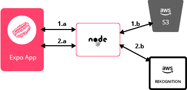

# Hot Dog Checker

  

* [Overview](#overview)
* [Demo](#demo)
* [Approach](#approach)
* [Known Limitations](#known-limitations)
* [Running Locally](#running-locally)
* [Deployment](#deployment)
* [License](#license)

# Overview

The Hot Dog Checker is a React Native app using [Amazon Image Rekognition](https://aws.amazon.com/rekognition/) to
check if the image is of a Hot Dog. This repo holds the Front End. There is a node server on the backend that
can be found [here](https://github.com/np6176a/server-hotdog)  

# Demo

You can check out a demo here: [https://expo.io/@findniya/hotdog](https://expo.io/@findniya/hotdog).
To view the project as a mobile app you will need to download Expo Client on your mobile device.
You can view in browser using the default Appetize.io setup in Expo or request a link in the Expo project page. 

# Approach

## Build Process

The build process is fully handled by the [expo.io](https://expo.io/) default configuration, which works great for this use case.

## Deploy Process

The project currently is published on [expo.io](https://expo.io/@findniya/hotdog). This is done manually using the expo IDE.

## Styling

Styling for each component is done using React Native's Stylesheet. Each component has its own
styles.js file.

## API Information

  

1. Once an image is selected.

⋅⋅⋅1a The mobile app makes an async await call to the node server to upload the selected image
and return a url to the image location.  
⋅⋅⋅1b The node server uses aws-sdk to connect an [S3 Bucket](https://aws.amazon.com/s3/) and upload the selected image. Once uploaded the S3 bucket returns a url for the image to the node server.  

2.The mobile app receives the url to the image.

⋅⋅⋅2a The mobile app sends the image url back to the node server to be analyzed by [Amazon Image Rekognition](https://aws.amazon.com/rekognition/). It expects
the return of a list of names (labels) from the node server. The list is then checked for the string 'Hot Dog'.  
⋅⋅⋅2b The node server uses the aws-sdk to send the image url to Amazon Rekognition's Detect Label service, which returns
an object of arrays. The node server maps the object to send a list of names (labels) to the front end.   

Note: There are two other potential solutions that would have worked here.

* Method one would have been to use AWS Amplify SDK on the front end to connect to AWS S3 and Rekognition. This method would not have needed a Node server. However, I was trying not to use an SDK on the front end for the purposes of this challenge. 

* Method two would have been to make one call from the front end and have the backend handle the logic to initiate the connection between S3 and Rekognition, then send one response to the front end containing the final list of names. I chose not do this for the purposes of this being a front end code challenge. Hence, I wanted to keep the logic in the front end and use the Node server purely to be a conduit between the mobile app and the AWS services.

# Known Limitations

## User Permissions
Currently the app does not handle instances when the user denies access to the device Camera or the Camera Roll.
This does need to be addressed at a later time. However, my focus right now was to use this as a way to learn React Native and
Amazon Web Services.

## State Management
The project uses basic React state to manage data without any external libraries. This
can work fairly well for these limited set of requirements; however, it can still
get messy. I've isolated the use of React state to just one parent container, making it fairly easy
to switch to React Context API or Redux at a later time.

## Navigation
I did not incorporate [React Navigation](https://github.com/react-navigation/react-navigation) or tap into mobile
gestures like swipes. As this is my first published React Native app, the focus was to get the app to communicate
properly with the node server and AWS.

## Testing
My tests will never fail because I have none! I chose not to incorporate tests at this time. 
However given more time, I would've added Jest tests for any of the utility functions as well as snapshot tests for many of the components.
I would also consider using something like Cypress to do full end-to-end tests.

# Running Front End Locally

1. Clone the repo

1. Install packages via `$ yarn install`

1. Start the development server via `$ yarn start`

1. Code to your ♡'s content

# License

This project is licensed under the [MIT License](./LICENSE)

# Contributions

This project is maintained by [FindNiya](https://www.findniya.com/). 
